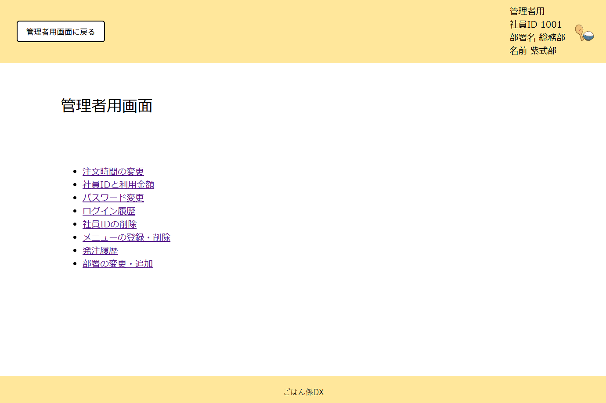
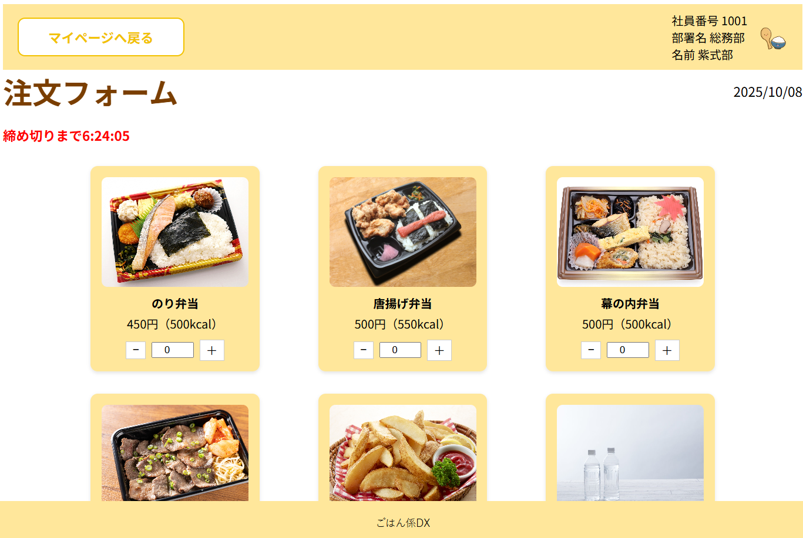
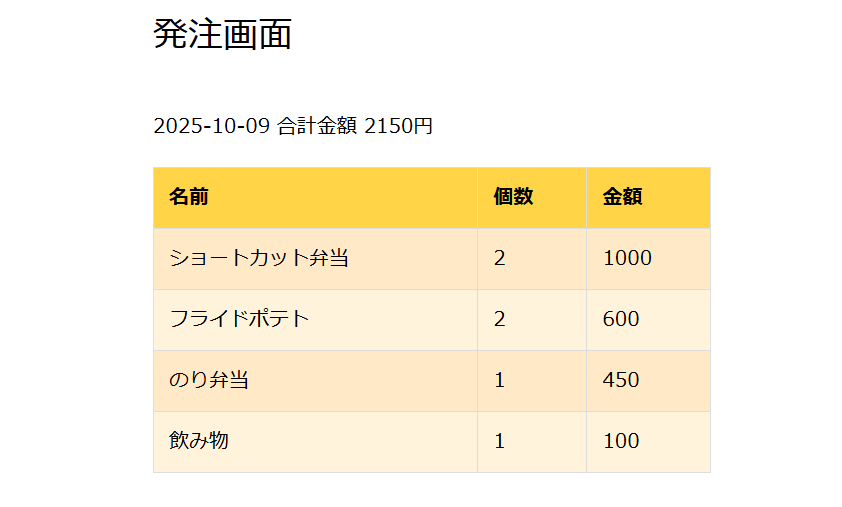
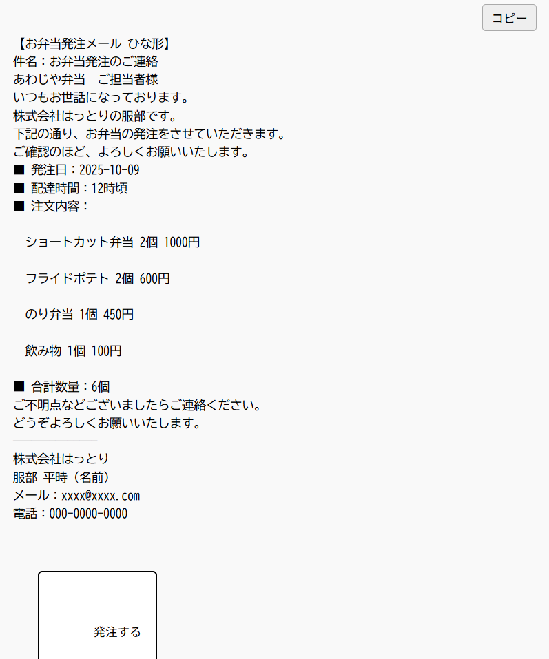
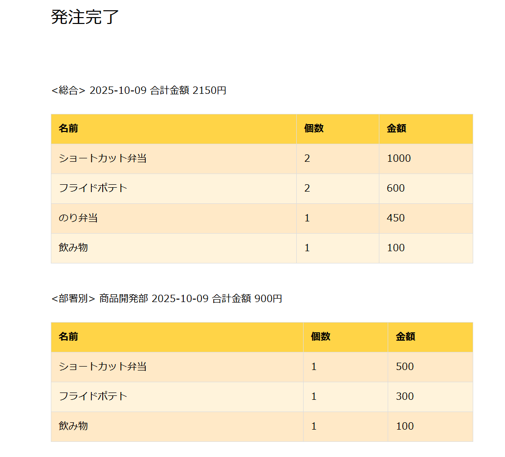
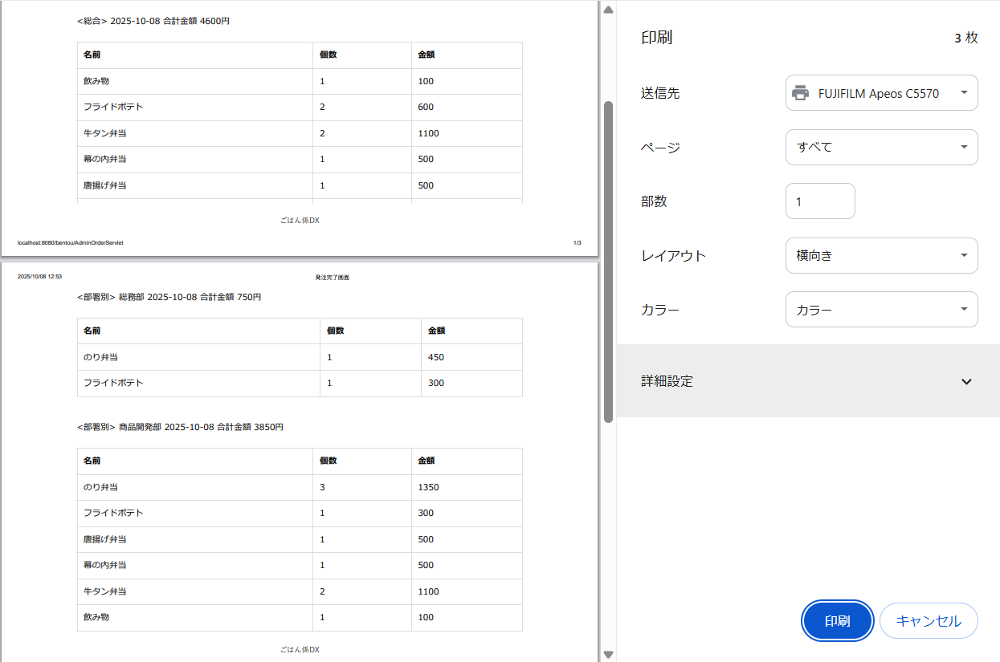
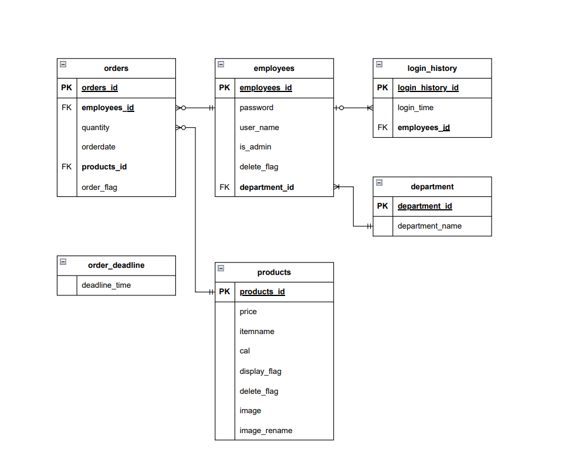

# ごはん係DX 🍱

企業オフィスのお弁当の注文と配膳の管理を行うツールです。

---

## 📚 目次

- [💡 プロジェクトについて](#-プロジェクトについて)
- [💻 使用技術](#-使用技術)
- [📜 ER図](#-er図)
- [🛠️ セットアップ](#-セットアップ)
- [🚀 使用方法](#-使用方法)
- [📜 ライセンス](#-ライセンス)
- [📧 連絡先](#-連絡先)

---

## 💡 プロジェクトについて

### 概要
この機能は、社内で必要な弁当の数を一括で取りまとめ、弁当屋へ正確に発注するためのものです。これにより、手書きや口頭による注文ミスを防ぎ、**注文の正確性が向上**します。また、社員一人ひとりの希望に沿った注文が可能になることで満足度も高まります。

さらに、過去の注文履歴を活用することで、人気の弁当や季節ごとの傾向を把握しやすくなり、今後のメニュー選定に役立てることができます。加えて、発注作業の自動化により、**担当者の業務負担を大幅に軽減**することも期待されます。

### 主要な機能

1.  **ユーザー管理機能**
    * 社員（一般ユーザー）と管理者を登録・管理し、ログインして弁当を注文できます。
    * 注文金額は月末に給料から自動天引きされます。
    * 管理者は全社員の注文内容を確認し、発注用メール（自動でひな形作成）を送信できます。
    
    

2.  **注文入力機能**
    * 社員は弁当の種類と数量を選んで注文でき、複数個の注文も可能です。
    * 注文には締め切り日時が設定され、期限までは内容の変更やキャンセルが可能です。
    
    

3.  **注文一覧・集計機能**
    * 全社員の注文情報を一覧表示し、弁当の種類ごとに自動で数量を集計できます。
    * 締め切り後は注文の修正を制限し、確定された情報で発注できます。
    
    

4.  **発注書作成・出力機能**
    * 集計結果をもとに発注書を自動作成し、画面表示または**CSV・PDF形式で出力**可能です。メールでの送信にも対応予定です。
    
    
    
    

    

---

## 💻 使用技術

このプロジェクトは、以下の開発環境で構築・動作することを想定しています。

| カテゴリ | 詳細 |
| :--- | :--- |
| **制作環境** | Eclipse |
| **使用言語** | Java, SQL, HTML, CSS, JavaScript |
| **ブラウザ** | Google Chrome |
| **データベース** | MySQL 8.0 |
| **WEBサーバー** | Apache |
| **アプリケーションサーバー** | Tomcat 10.1 |

---

## 📜 ER図

プロジェクトのデータベース構造を示すER図です。

---

## 🛠️ セットアップ

プロジェクトをローカル環境で実行するための手順です。

### 前提条件

以下のソフトウェアが事前にインストールされ、正しく設定されている必要があります。

* **IDE**: Eclipse IDE version **2025-06** (4.360)
* **データベース管理ツール**: MySQL Workbench **8.0.41**
* **データベース**: MySQL 8.0
* **アプリケーションサーバー**: Tomcat 10.1

### インストール・実行方法

1.  **プロジェクトのインポート**
    * Eclipseを起動します。
    * メニューから「**ファイル**」→「**インポート**」→「**一般**」→「**既存プロジェクトをワークスペースへ**」を選択します。
    * 「**ルートディレクトリの選択**」からプロジェクトのアーカイブ（例: `bentou` フォルダ）を参照し、プロジェクトをワークスペースにインポートします。
2.  **ライブラリ（JARファイル）の追加**
    * 以下のライブラリファイルをダウンロードし、**プロジェクト内の `WEB-INF/lib` フォルダにコピー**してください。
| ファイル名 | 用途 | ダウンロードリンク (Maven Central) |
| :--- | :--- | :--- |
| `jakarta.servlet.jsp.jstl-3.0.1.jar` | JSTL (JSP Standard Tag Library) の実装 | [Download](https://central.sonatype.com/artifact/org.glassfish.web/jakarta.servlet.jsp.jstl/3.0.1) |
| `jakarta.servlet.jsp.jstl-api-3.0.0.jar` | JSTL のAPI | [Download](https://mvnrepository.com/artifact/jakarta.servlet.jsp.jstl/jakarta.servlet.jsp.jstl-api/3.0.0) |
| `json-20250517.jar` | JSON処理ライブラリ | [Download](https://mvnrepository.com/artifact/org.json/json/20250517) |
| `mysql-connector-j-8.0.33.jar` | MySQL JDBCドライバー | [Download](https://www.mysql.com/products/connector/j/) |
3.  **データベース設定**
    * MySQL Workbenchを使用してデータベース環境を準備します。（データベース名、ユーザー名、パスワードを設定し、プロジェクトのDB接続設定と一致させてください。）
    * **必要なテーブル作成SQLは、以下のファイルを参照して実行してください。**
        * `||` フォルダ内にある **`ごはん係DXデータベース初期作成SQL文.sql`**
    * 初期データを投入します。
4.  **サーバーへのデプロイ・起動**
    * Eclipseでサーバーを起動した後、プロジェクトの起点となる **ログイン画面のURLにアクセス** します。
    * **または、** bento-src-main-java-servlet` フォルダ内の **`WelcomeServlet.java`** を右クリックし、「**実行**」→「**サーバーから実行**」を選択してアプリケーションを起動します。（この操作により、自動的に `/login` パスでブラウザが開きます。）

---

## 🚀 使用方法

サーバー起動後、以下のURLにアクセスしてください。
`http://localhost:8080/bentou/login` 

### 初期ログイン情報 (例)
| ユーザー種別 | ユーザーID | パスワード |
| :--- | :--- | :--- |
| 管理者 | `1001` | `superuser` |

---

## 📜 ライセンス

このプロジェクトは **[ライセンス名]** の下で公開されています。詳細については `LICENSE` ファイルを参照してください。

---

## 📧 連絡先

プロジェクトに関する質問やフィードバックは、以下にご連絡ください。

* **GitHub**: [@newosoal21-pixel](https://github.com/newosoal21-pixel)
* **Email**: [newosoal21@gmail.com](mailto:newosoal21@gmail.com)
